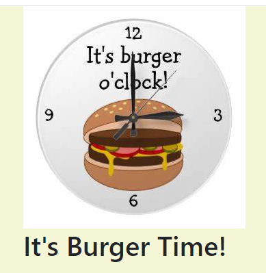

# Burger Grubbing: burger logger

## Table of Contents

[Project Description](#description)

[Tech used](#tech-used)

[Credits](#credits)
 
[Installation Guide](#installation-guide)

[Contribution Guidelines](#contribution-guidelines)

[License Information](#license-information)

[Questions](#questions)

## Description

A burger logger with MySQL, Node, Express, Handlebars, and a homemade ORM.

[Github Repo](https://github.com/maggiemaywilder/burgerGrubbing)

[Deployed application](https://calm-hamlet-80672.herokuapp.com/)

## Tech used

MySql, Node, Express, Handlebars, Bootstrap

## Credits

[Steve Griffith](https://www.youtube.com/channel/UCTBGXCJHORQjivtgtMsmkAQ) continues to be a reliable resource and one of the first places I turn for tutorials.

## Installation Guide

npm install

## Contribution Guidelines

Feel free to contact me through github or my email

## License Information

Notice: This application is covered under the MIT license.

 [License: MIT](https://opensource.org/licenses/MIT)

## Questions

If you have any questions, please feel free to reach out via one of the following avenues.

#### Contact info

[My GitHub](https://github.com/maggiemaywilder)

[My email](mailto:maggiemaywilder@gmail.com)